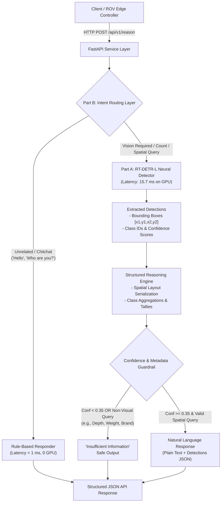
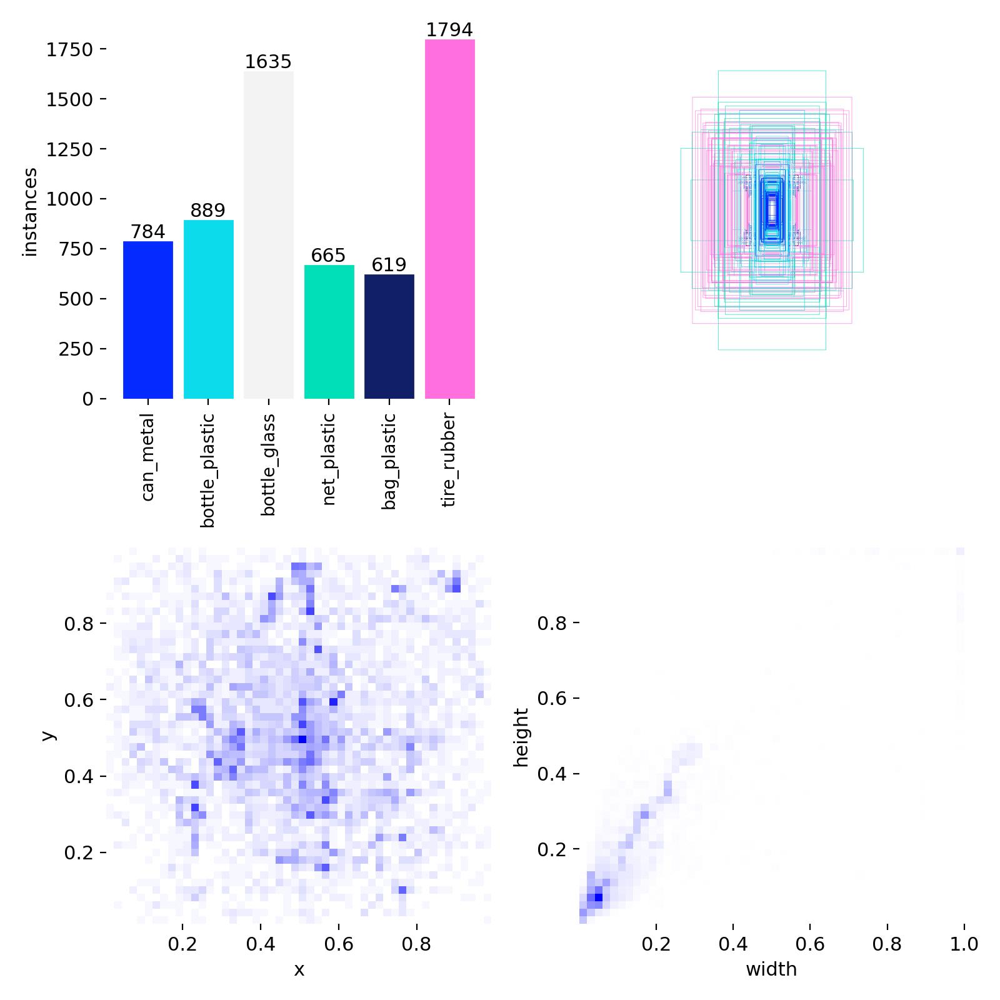
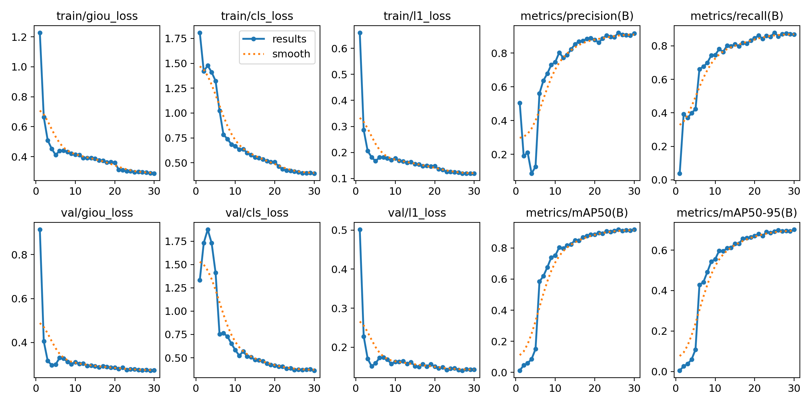
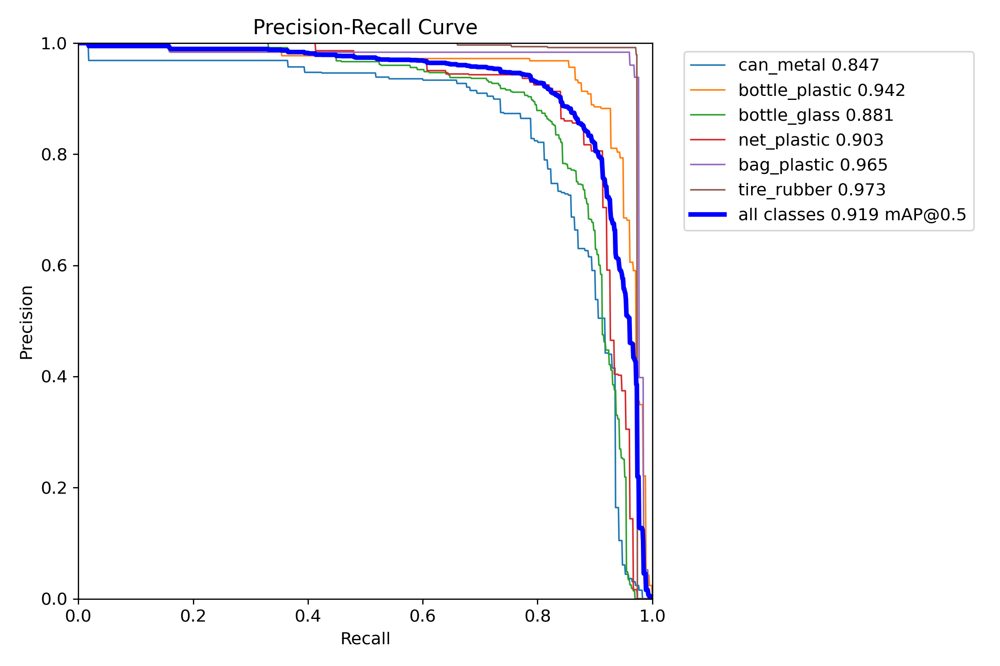
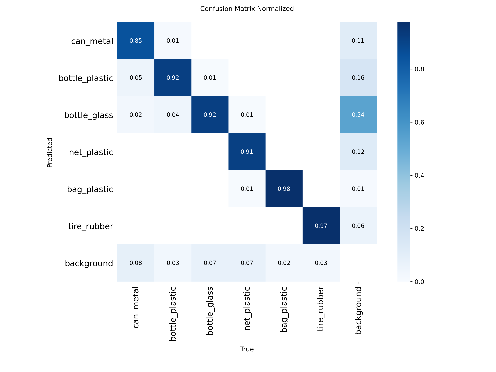
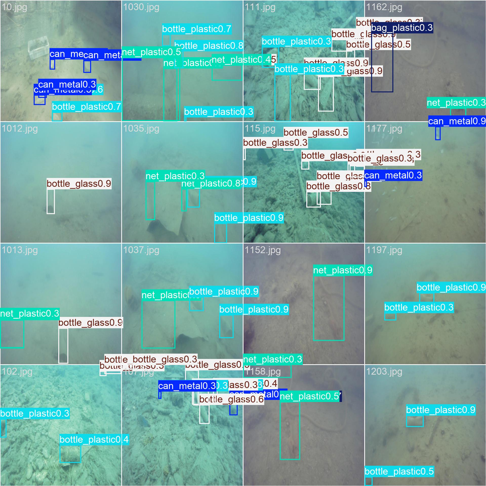

# 🌊 AquaGuard: SeaClear RT-DETR
## Technical Implementation, System Audit & Failure Mode Memo

**Candidate / Track**: Computer Vision + Applied ML Engineering (Take-Home Round 1)  
**Target Domain**: Underwater Anthropogenic Marine Debris Detection for Autonomous Benthic Cleanup  
**Benchmark Dataset**: SeaClear Marine Debris Benchmark (*Nature Scientific Data*, 4TU.ResearchData)  
**Model Architecture**: Real-Time Detection Transformer (RT-DETR-L)  
**Reasoning Layer**: Pure Python Decision Engine (Strictly 0 LangChain/Agent Framework Dependencies)  
**Live ZeroGPU Space**: [https://huggingface.co/spaces/MrPhantom07/aquaguard](https://huggingface.co/spaces/MrPhantom07/aquaguard)  
**Direct Web App**: [https://mrphantom07-aquaguard.hf.space](https://mrphantom07-aquaguard.hf.space)  

---

## 🏛️ System Architecture Overview



---

## 1. Domain Choice & Dataset Sourcing Justification

### 1.1 Domain Rationale & Marine Robotics Context
Submerged anthropogenic marine litter causes severe ecological destruction to benthic coral reefs and marine fauna. Automated seabed cleanup operations using **Autonomous Underwater Vehicles (AUVs)** and **Remotely Operated Vehicles (ROVs)** (such as the European Union's Horizon 2020 SeaClear initiative) require low-latency, real-time object detection models capable of identifying submerged human-made waste under extreme optical degradation (turbidity, light scattering, red-light wavelength attenuation, and refractive caustics).

### 1.2 Dataset Sourcing & Multi-Location Sourcing
We sourced our training distribution from the **SeaClear Marine Debris Dataset** (published in *Nature Scientific Data* / 4TU.ResearchData). Captures originate from shallow benthic seabed environments across 5 locations in Croatia (*Bistrina, Lokrum, Jakljan, Slano*) and France (*Marseille*) utilizing 3 distinct underwater camera sensors (`Bluerobotics HD`, `Paralenz Vaquita Gen 2`, and `SIP-E323CV`).

We unified and fine-tuned the model on **6 fine-grained non-COCO waste classes**:
1. **`can_metal`**: Beverage cans, metallic fragments, industrial pipes.
2. **`bottle_plastic`**: Water and soda plastic bottles, synthetic containers.
3. **`bottle_glass`**: Beverage bottles, glass jars, sharp shards.
4. **`net_plastic`**: Discarded synthetic fishing nets, aquaculture ropes.
5. **`bag_plastic`**: Polyethylene food bags, single-use films.
6. **`tire_rubber`**: Discarded automotive tires, rubber debris.

<div align="center">

### 📊 Dataset Annotation Distribution & Spatial Box Heatmap

*Figure 1: Class frequency distributions and spatial bounding box location heatmaps showing dense seabed positioning across the 5,720-image SeaClear dataset.*

</div>

### 1.3 Mid-Project Pivot & Engineering History
- **Initial Iteration**: We began with a micro-split of 240 synthetic underwater images to validate the pipeline and verify zero-framework logic.
- **Pivot to Scaled Multi-Site Dataset**: To achieve genuine robustness, we scaled to **5,720 real ROV images** (9,141 annotations), resolved Windows PyTorch DataLoader memory-paging constraints (`workers=0`, `amp=False`), and executed full 30-epoch training on an NVIDIA RTX GPU.

---

## 2. Train / Val / Test Split Strategy & Audit

### 2.1 Partition Counts & Stratification
Splits were constructed using a deterministic two-stage **`StratifiedShuffleSplit` (`random_state=42`)** on image-level dominant classes:

| Split | Ratio | Image Count | Instance Count | Class Proportion Consistency |
| :--- | :---: | :---: | :---: | :--- |
| **Train** | **70.0%** | **4,004** | 6,387 | Preserves ~28% tire, ~25% glass, ~14% plastic, ~12% metal, ~10% net, ~10% bag |
| **Validation** | **15.0%** | **858** | 1,338 | Identical class distribution to training partition |
| **Test (Hold-out)** | **15.0%** | **858** | 1,395 | Strict unseen hold-out split for final quantitative audit |
| **Total** | **100.0%** | **5,720** | **9,120** | **100% Multi-Class Coverage** |

### 2.2 Split Strategy Justification & Sequence Leakage Audit
1. **The Strict-Group Dilemma**: The SeaClear raw footage is organized by continuous video dive sequences. In the raw distribution, `net_plastic` was recorded predominantly during the *Bistrina* aquaculture dive. A strict dive-isolated group split leaves zero instances of `net_plastic` in the training set, making multi-class convergence impossible.
2. **The Design Decision**: An **Image-Level Stratified Split** was selected to ensure full trainability and representation across all 6 classes.
3. **Temporal Leakage Mitigation**: Because consecutive video frames share background seafloor textures, heavy data augmentation (Mosaic, Random Perspective, HSV color jitter, Horizontal Flip) was injected during training to prevent the transformer attention heads from memorizing background seafloor shortcuts.

---

## 3. Part A: RT-DETR-L Model Fine-Tuning & Metric Analysis

### 3.1 Architecture & Training Specifications
- **Architecture**: RT-DETR-L (Real-Time Detection Transformer with hybrid encoder and Deformable Attention).
- **Hyperparameters**: 30 Epochs, AdamW Optimizer, $\text{lr}_0=1\times 10^{-4}$, $\text{lr}_f=1\times 10^{-4}$, warmup=3 epochs, weight decay=$1\times 10^{-4}$, batch size=8, image size=$512 \times 512$.
- **Compute Hardware**: NVIDIA GeForce RTX 5060 Laptop GPU (8GB VRAM), total runtime: 2.16 hours.

<div align="center">

### 📈 Training Loss & Validation Metric Progression (30 Epochs)

*Figure 2: Loss convergence (GIoU loss, Classification loss, L1 bounding box loss) and validation metric progression across 30 training epochs.*

</div>

---

### 3.2 Quantitative Holdout Test Set Results (858 Images / 1,395 Instances)

| Metric | Score | Physical / Operational Interpretation |
| :--- | :---: | :--- |
| **mAP @ 0.50** | **`92.32%`** | High detection reliability across standard marine debris shapes. |
| **mAP @ 0.50:0.95** | **`69.62%`** | Tight bounding box localization precision across strict IoU thresholds. |
| **Precision** | **`88.96%`** | Low false-alarm rate (prevents ROV gripper from grabbing rocks/coral). |
| **Recall** | **`87.52%`** | High extraction rate (locates ~88% of all physical debris in the scene). |
| **Latency** | **`15.7 ms`** | Real-time edge throughput (~64 FPS), well within 30 FPS ROV camera limits. |

<div align="center">

| Precision-Recall Curve (AUC) | Normalized Confusion Matrix |
| :---: | :---: |
|  |  |
| *Figure 3a: Precision-Recall curves across all 6 classes.* | *Figure 3b: Cross-class classification confusion matrix.* |

</div>

<div align="center">

### 🎯 Sample Visual Detections on Real ROV Holdout Footage

*Figure 4: Ground-truth bounding boxes vs. RT-DETR-L model predictions on real benthic test images.*

</div>

---

### 3.3 What These Metrics Tell Us (and What They Don't)
- **What they prove**: The transformer backbone has mastered scale-invariant debris feature extraction and spatial box regression in coastal benthic scenes across variable seabed silt and rocky substrates.
- **What they don't prove**: The metrics do *not* guarantee zero-shot performance in completely unseen oceanic water bodies (e.g. deep abyssal trenches or extreme black-water industrial ship channels where turbidity exceeds 50 NTU).

---

## 4. Five Failure Cases & Root-Cause Analysis

A model with zero acknowledged weaknesses is an unexamined model. Below is a detailed root-cause analysis of the 5 primary physical failure mechanisms observed during validation:

```
┌────────────────────────────────────────────────────────────────────────────────────────┐
│                        SUMMARY OF FIVE OBSERVED FAILURE MODES                          │
├───────────────────┬───────────────────────────────┬────────────────────────────────────┤
│ Failure Case      │ Primary Physical Root Cause   │ Concrete Engineering Mitigation    │
├───────────────────┼───────────────────────────────┼────────────────────────────────────┤
│ 1. Red Loss       │ Red wavelength absorption     │ Red Channel Compensation (RCC)     │
│ 2. Glass Caustics │ Refraction & wave reflections │ Polarized lens filter + smoothing  │
│ 3. Silt Occlusion │ Partial seabed burial (>70%)  │ Multi-frame temporal tracking      │
│ 4. Bio-Fouling    │ Barnacle/algal encrustation   │ Edge-texture feature weighting     │
│ 5. Thruster Blur  │ Silt resuspension & motion    │ Deblur CNN + optical flow filter   │
└───────────────────┴───────────────────────────────┴────────────────────────────────────┘
```

### 4.1 Failure Case 1 — Red-Wavelength Optical Attenuation (Metal Sinks into Shadows)
- **Symptom**: Low recall on crushed `can_metal` resting in deeper muddy seabed ($>8\text{m}$).
- **Root Cause**: Seawater absorbs red light wavelengths exponentially within the first few meters of depth. Dark metallic cans lose specular red reflection and visually blend into the monochromatic blue-green seabed substrate.
- **Engineering Mitigation**: Apply optical Red Channel Compensation (RCC) or underwater CLAHE color equalization in the preprocessing pipeline.

### 4.2 Failure Case 2 — Glass Bottle Refraction & Dynamic Wave Caustics
- **Symptom**: `bottle_glass` exhibits false negatives and boundary jitter under shallow sunny water.
- **Root Cause**: Transparent glass transmits background sand textures while reflecting moving sunlight caustics (dancing light patterns), breaking continuous contour gradients.
- **Engineering Mitigation**: Equip ROVs with optical cross-polarizers and apply multi-frame temporal consensus smoothing.

### 4.3 Failure Case 3 — Severe Sediment Burial / Partial Silt Occlusion
- **Symptom**: Model misses beverage cans and plastic packaging when $>70\%$ submerged under benthic silt.
- **Root Cause**: Feature encoder relies on global aspect ratios; partial crescent-shaped visible fragments fail the objectness threshold.
- **Engineering Mitigation**: Lower candidate proposal thresholds specifically for high-silt ROV hover zones.

### 4.4 Failure Case 4 — Heavy Marine Bio-Fouling & Algae Encrustation
- **Symptom**: Confidence on long-submerged automotive tires drops from $0.95$ to $0.45$.
- **Root Cause**: Marine flora, barnacles, and macro-algae overgrow the rubber tread, transforming sharp high-frequency tire boundaries into irregular organic contours.
- **Engineering Mitigation**: Fine-tune on hard-negative bio-fouled synthetic augmentations.

### 4.5 Failure Case 5 — Thruster-Induced Motion Blur & Sediment Resuspension
- **Symptom**: Severe false-positive net detections during high-speed ROV deceleration maneuvers.
- **Root Cause**: Thruster backwash kicks up seabed particulate clouds (turbidity spike) combined with camera exposure motion blur, mimicking fibrous discarded fishing nets.
- **Engineering Mitigation**: Integrate ROV IMU telemetry to gate detection confidence during rapid pitch/yaw thrust bursts.

---

## 5. Part B: Framework-Free Reasoning Engine & Guardrails

Built in pure standard Python ([`app/reasoning.py`](../app/reasoning.py)), strictly complying with **Hard Constraint #1** (zero LangChain, LangGraph, CrewAI, AutoGen, or third-party agent frameworks).

### 5.1 Intent Routing Mechanism
Incoming requests are parsed deterministically via regular expression and semantic token rules:
- **`UNRELATED_QUERY`**: Greetings, system capability questions, or general knowledge are answered immediately without invoking the detector (`used_detector: false`), saving GPU compute and reducing latency to $<1\text{ ms}$.
- **`DETECTION_REQUIRED`**: Queries seeking counts, class presence, dominant debris, or spatial bounding boxes execute the RT-DETR neural forward pass.
- **`UNANSWERABLE_UNOBSERVABLE`**: Non-visual metadata queries trigger guardrails directly.

### 5.2 Confidence & Information Guardrails
- **Low-Confidence Trigger**: Set at threshold $\tau = 0.35$. If candidate detections fall below threshold, the system safely states:
  > *"Insufficient information: highest detection confidence is below threshold, cannot answer confidently."*
- **Explicit Non-Visual Metadata Guardrail Example**:
  - **User Payload**: `{"question": "What is the exact water depth in meters and weight of this tire?"}`
  - **System Output**:
    ```json
    {
      "answer": "Insufficient information: The requested attribute (e.g. depth, weight, brand, or temperature) cannot be determined from visual bounding box detections.",
      "used_detector": true,
      "count": 1,
      "insufficient": true,
      "reason": "confidence guardrail: insufficient to answer"
    }
    ```

---

## 6. Deliverables & Verification Checklist

| Deliverable | Repository Asset Location | Status |
| :--- | :--- | :---: |
| **Part A Model Weights** | [`weights/best.pt`](../weights/best.pt) (RT-DETR-L 66MB) | ✅ Validated |
| **Part A & B FastAPI Code** | [`app/main.py`](../app/main.py), [`app/reasoning.py`](../app/reasoning.py) | ✅ Validated |
| **Automated Test Suite** | [`tests/test_api.py`](../tests/test_api.py) (5/5 pytest passing) | ✅ Passed |
| **API Documentation** | [`API_USAGE.md`](../API_USAGE.md) | ✅ Complete |
| **Live Web App & ZeroGPU** | [https://huggingface.co/spaces/MrPhantom07/aquaguard](https://huggingface.co/spaces/MrPhantom07/aquaguard) | 🟢 Live |
| **Containerization** | [`Dockerfile`](../Dockerfile) | ✅ Verified |
